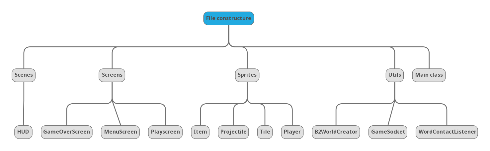

# Animal Slaughter House

## How to play
To run the jar, input command
``java -jar .\desktop-1.0.jar [ip] ``
Current server ip:  10.46.180.92
You will need node.js to run the server.
WASD to move, click to shoot.

## Brief introduction

- A primitive 2D game implemented with LibGDX.
- Features: Multiplayer, online battle-royale.
- Basic settings
    - Each player has 100 HP at the beginning.
    - Every player will be spawned in the bottom left corner of the entire map.
    - There are a few drop points scattered in the world where you can pick up a specific weapon. After that, you can use your current weapon to attack other players on the server.
    - Kill all players on the server and survive to the end to win!

## Main Framework

## A few points to note
### 1. Box2d physics engine
- Our game engine uses Box2d, and there is a slight recoil when firing.

### 2. Projectile class as an example of sprite

- Everything shown in the screen is a sprite.
- Projectile inherits from Sprite class of LibGDX.

### 3. implementation of online multiplayer
We used socket.io to implement our online multiplayer.
Socket.io is event-driven and is 
We made the server using node.js to simplify the work.
There is a host that actually update the world,
other players(slaves) only listen to the host and update
from the host.
- For every frame, the host pack sprites in the world into 
a json file to synchronize all clients.

### 4. drawing map and sprites
LibGDX offers a way to create textures for sprites.
For each frame sprites are batched and rendered.
- map: We use Tiled(https://www.mapeditor.org/)  to make our map,
  and loaded by class ==TmxMaPLoader==.
- sprites: most pixelated pictures found online. 
  All sprites are rendered in ==PlayScreen== and some of the sprites are animated by a series of pictures.
### 5. bgm & sound effect
We implement sound using LibGDX native libraries,
BGM is made by us and copyleft.

### 6. particle effect
particle effects are provided by LibGDX.
These effects, generally speaking, are also sprites.
